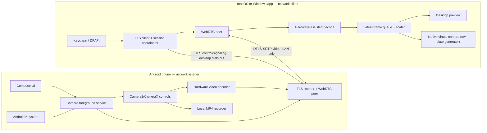

# Meo Camera — Product and Engineering Plan

Status: in progress
Scope: Android sender + macOS receiver/virtual camera + Windows receiver/virtual camera
License: MIT
Maintainer model: single maintainer
Budget: zero recurring cost
Planning date: 2026-07-26

> **Milestone 0 is in progress and has already contradicted this document.**
>
> §8.1's primary macOS path — build from source, `systemextensionsctl
> developer on`, SIP intact — **does not exist on current macOS**. Developer
> mode now refuses to run while SIP is enabled, and an ad-hoc app that claims
> the system-extension entitlement is killed at launch. Measured 2026-08-07 on
> macOS 26.5.1; see [`adr/0004-macos-distribution-reality.md`](adr/0004-macos-distribution-reality.md)
> and the raw run in
> [`probes/macos-camera-extension/RESULTS-2026-08-07.md`](probes/macos-camera-extension/RESULTS-2026-08-07.md).
>
> Consequences: macOS Camera is **blocked**, Windows is the first desktop
> platform ([`adr/0005`](adr/0005-first-desktop-platform.md)), and §8.1 and §16
> below are stale where they promise a working build-from-source macOS story.
> The Windows probes (§18 steps 1 and 3) are written but not yet run, so
> [`adr/0002`](adr/0002-directshow-scope.md) and
> [`adr/0003`](adr/0003-windows-registration-scope.md) decide nothing yet.
>
> Read [`adr/README.md`](adr/README.md) before trusting any section below.

### Android transport progress — 2026-08-14

The Android sender is now built end to end, from the camera to a WebRTC peer,
with the control plane verified over a real TLS connection.

**Built and verified on the JVM (97 tests):**

- `protocol/` — the versioned JSON control plane of §5.3, with hard inbound
  limits, unknown *fields* tolerated and unknown *message types* refused with a
  typed error. Golden fixtures live in the repository's `protocol/fixtures/` and
  are asserted in both directions, so a silent wire change fails the build.
- `pairing/` — self-signed EC identity, SPKI pinning, the one-time five-minute
  code of §6.1, per-pairing 256-bit credentials with the §6.1 step 8 sliding
  30-day expiry, and the channel-bound HMAC of §6.2 step 5. Keystore-backed
  encrypted storage.
- `network/ControlListener` — the phone-listens/desktop-dials arrangement of
  §5.1, bound only to a private address and refusing a wildcard even when asked.
  One session at a time.
- `network/IceCandidateFilter` — §6.4's local-route enforcement: host candidates
  only, on a network this device is actually on, no relay, no loopback, no
  mDNS-obfuscated addresses, and never a DNS lookup on peer-supplied text.
- `camera/encode/YuvConverter` — the row-padding and interleaved-chroma cases
  that a real device produces.

[ADR 0009](adr/0009-android-session-handshake.md) records the handshake as
built, including one deliberate weakening (the TLS private key is wrapped by a
Keystore key rather than being a non-extractable Keystore key) and why.

**Built but never run, because no device is attached to the development host:**

- `network/WebRtcPeer` — compiles against the real WebRTC AAR; needs
  `libjingle_peerconnection_so.so` and a camera.
- `camera/encode/WebRtcFrameSink` — the CameraX-to-I420 bridge. [ADR 0008](adr/0008-android-webrtc-distribution.md)
  requires the CameraX-versus-`Camera2Capturer` choice be made on measured
  720p30 CPU and thermal figures; it is **provisional** until that happens.
- `discovery/CameraAdvertiser` — needs Android's `NsdManager`.
- Real sensor output, lens switching, display-off continuation, OEM battery
  behaviour, and every FPS and thermal claim.

**Still missing entirely:** the desktop. No receiver exists on any platform, so
no end-to-end video path has ever been exercised — `TestDesktopClient` in the
test sources is a working reference for the protocol, not a product. The
Windows frame bridge also remains unreachable across the session boundary
measured in [ADR 0006](adr/0006-windows-frame-bridge.md).

### Android capture progress — 2026-08-09

The first Android camera source slice exists under
`android-app/app/src/main/java/com/meo/camera/`:

- A separate `camera` foreground service owns CameraX capture, the partial wake
  lock, and deterministic stop cleanup. The Activity only attaches an optional
  preview surface, so leaving the screen does not own or end capture.
- The capture probe requests 1280x720, keeps only the latest analysis frame,
  reports the applied frame size and rolling FPS, and supports front/back lens,
  zoom, and torch where the device reports them.
- The existing microphone UI and UDP service remain separate. The launcher is
  now **Meo**, with a camera entry point from the Mic screen.
- CameraX is pinned to `1.5.3`: `1.6.x` requires Kotlin 2.1 metadata and would
  turn this narrow probe into a Compose/Kotlin toolchain migration.
- `testDebugUnitTest`, `assembleDebug`, and `lintDebug` pass locally. No Android
  device is attached to the development host, so real sensor output, lens
  switching, display-off continuation, OEM battery behavior, and thermal/FPS
  claims remain unverified.

That slice was capture infrastructure only. The transport described in the
section above was added on 2026-08-14 and supersedes the "no TLS listener, no
WebRTC sender" statement that stood here.

## 0. Constraints that shape every decision below

These are not preferences. They are inputs that change the architecture, and the
rest of this document is written around them.

**C1 — No recurring money.** No paid Apple Developer account, no Windows
code-signing certificate, no Play Console fee, no hosted services. Anything that
requires a yearly payment to *function* is out.

**C2 — One-time UAC/admin prompts are acceptable.** The constraint is money, not
friction. An installer that asks for administrator approval once is fine. An
installer that requires a purchased certificate is not.

**C3 — Single maintainer.** No contributor onboarding process, no CI designed for
forks, no review workflow. CI exists only to stop the maintainer from shipping a
broken build. The repo stays MIT and PRs are welcome, but nothing in this plan
depends on anyone else showing up.

**C4 — Ordering matters, duration does not.** Milestones below are dependency-
ordered with hard exit gates. There are deliberately no time estimates. The gates
are the contract; how fast they fall is irrelevant.

**C5 — All three operating systems are in scope.** Android sender, macOS
receiver, Windows receiver. The sequencing below builds one desktop path
completely before porting, so the frame-bridge and virtual-camera lessons are
learned once instead of three times. That is sequencing, not scope reduction.

## 1. Product definition

Meo Camera turns an Android phone into a webcam that appears as a system camera
in Zoom, Discord, Google Meet, Teams, OBS, browsers, and other camera-aware
desktop applications.

The product must be:

- Free, open source, ad-free, and usable without an account.
- Local-network-only. There is no internet video relay and no remote viewing.
- Fast to pair: scan one QR code, then reconnect without scanning, indefinitely.
- Safe by default: encrypted media, an obvious capture indicator, one-click
  pause, and easy device revocation.
- Smooth under normal Wi-Fi conditions, with graceful quality reduction rather
  than long freezes.
- Native where the operating system requires it, especially the desktop virtual
  camera layer.
- Installable and updatable with no paid signing identity anywhere in the chain.

### 1.1 The device name is not fully ours to choose

On macOS, the Core Media I/O extension controls its own display name, so the
camera appears exactly as **Meo Camera**.

On Windows 11, `MFCreateVirtualCamera` **appends its own suffix**. Microsoft's
documentation states the pipeline automatically appends "Windows Virtual Camera"
to the supplied friendly name so users can distinguish virtual cameras from
physical ones. There is no flag to suppress this.

Consequences:

- Do not promise a single exact string across platforms.
- Documentation and screenshots must show the real Windows name, not an
  idealized one.
- Pick a `friendlyName` that still reads well with a suffix attached — `Meo
  Camera` becomes `Meo Camera (Windows Virtual Camera)` or similar. Verify the
  exact rendering in Milestone 0 and write the observed string into the docs.
- On the Windows 10 DirectShow path the filter name *is* fully ours, so the two
  Windows backends will present different names. Document this rather than
  fighting it.

### Product promise

> Install Meo on the computer and Android phone, scan once, and pick the Meo
> camera in any meeting app.

### Pairing lifetime: sliding, not fixed

A previous draft of this plan expired pairings after a fixed 30 days. That was a
slogan, not a requirement — it forced the user to locate their phone and re-scan
on a schedule forever, and bought nothing that explicit revocation does not
already provide.

Replacement rule: **each successful authenticated connection extends the pairing
by 30 days.** Actively used pairings never expire. Abandoned ones age out on
their own. The user can revoke from either device at any time, which is the
control that actually matters.

The QR scan therefore creates a trusted pairing, not an open network connection.
During its life:

1. Both apps rediscover each other when they are on the same local network.
2. The phone reconnects with one tap, or automatically if the user enabled
   auto-connect.
3. The pairing renews itself on use, and expires only after 30 days of no
   successful connection.
4. Either device can revoke the pairing at any time, immediately.

### Meaning of "same Wi-Fi"

Meo requires the devices to be on the same local network. This allows a desktop
on Ethernet and a phone on Wi-Fi behind the same router. Meo will not use public
STUN, TURN, cloud relays, port forwarding, or an internet rendezvous service.

Guest Wi-Fi and AP client isolation may prevent devices from seeing each other.
The apps must detect this and explain it in plain language.

## 2. Product scope

### 2.1 Version 1.0 requirements

Pairing and connection:

- QR pairing from the Android app.
- Sliding 30-day trusted-device credential, renewed on every successful connect.
- mDNS/Bonjour rediscovery after pairing.
- Manual address entry fallback for networks where mDNS is blocked.
- Automatic recovery after brief Wi-Fi interruption or DHCP address change.
- Multiple saved computers on one phone and multiple saved phones on one
  computer, with only one active phone stream per virtual camera in v1.
- Rename and revoke paired devices.

Camera:

- Front/rear camera switching.
- Capability-based 480p, 720p, and 1080p selection.
- 24/30 FPS, and 60 FPS only where the device, resolution, and encoder are all
  proven to sustain it.
- Adaptive bitrate with Low, Balanced, and High quality presets.
- Pinch-to-zoom on phone and zoom slider on desktop.
- Tap-to-focus, autofocus reset, exposure compensation, and torch where
  supported.
- Portrait/landscape rotation handling.
- Separate "mirror phone preview" and "mirror webcam output" controls.
- Fit, fill/crop, 16:9, and 4:3 framing.
- Pause video to a privacy slate; never leave an ambiguous frozen face.
- Phone screen may turn off while a user-started foreground capture session
  continues.
- Optional local recording to the phone, with duration, storage, and failure
  status visible on both devices. Sequenced after the virtual-camera paths work
  (see Milestone 7) because it depends on an unresolved encoder question.

Desktop:

- Live preview and connection/quality status.
- A system camera visible to meeting apps.
- Stable output cadence even while the network is recovering.
- A privacy slate when disconnected, paused, or permission is revoked, generated
  by the virtual camera itself so it survives the host app being closed.
- Controls for resolution, FPS, quality, zoom, lens, focus, torch, orientation,
  mirror, and recording.
- Remember settings per paired phone.
- Tray/menu-bar mode and launch-at-login option.
- Local diagnostic report export with secrets redacted.

Interoperability:

- Zoom, Discord, Google Meet in Chrome/Edge/Safari, Microsoft Teams, OBS,
  FaceTime/Photo Booth on macOS, and the Windows Camera app.
- Coverage is determined by which **capture API** each app uses, not by which OS
  version it runs on. See §9.1 and §13.2.
- Meo Mic remains selectable as the microphone. Camera v1 does not embed audio
  inside the virtual video device.

### 2.2 Version 1.1 candidates

- Simultaneous Meo Camera + Meo Mic session with one connection screen, plus the
  audio-delay alignment work described in §11.2.
- Snapshot capture to the phone or desktop.
- Manual white balance and color-temperature lock where hardware supports it.
- Background blur using an on-device segmentation model.
- USB transport fallback.
- Multiple scene presets and hotkeys.
- Windows on ARM and macOS Intel after the primary paths are stable.

### 2.3 Explicitly out of scope for v1

- Internet/WAN streaming.
- Cloud accounts, cloud recording, analytics, or remote device control.
- iPhone/iPad sender.
- 4K output, HDR, multi-camera compositing, filters, beauty effects, and
  chroma-key.
- More than one active phone feed.
- Surveillance, unattended capture, or silently starting the camera.
- Any distribution channel that requires a paid identity.

## 3. Supported platforms

| Component | Initial target | Notes |
|---|---|---|
| Android sender | Android 10+ | CameraX/Camera2 capability varies by phone. Android 7–9 support from Meo Mic does not carry over. |
| macOS receiver | macOS 12.3+; Apple Silicon first | 12.3 is the floor for Core Media I/O camera extensions. Do not inherit Meo Mic's macOS 14 target — that was inertia, not an API requirement. |
| Windows receiver | Windows 10 and 11, x64 | Backend selection is driven by the consuming app's capture API, not the OS version. Both a Media Foundation source and a DirectShow filter are planned. |

Windows 10 is no longer treated as the reason DirectShow exists. §9.1 explains
why.

## 4. Existing Meo code: keep, change, and avoid

The repository currently has:

- Android Kotlin/Compose capture, foreground-service, and mDNS patterns for
  audio (~1,700 lines).
- A native Swift/SwiftUI macOS receiver built with Swift Package Manager
  (~1,300 lines).
- A Python/Tkinter Windows receiver (~3,200 lines).
- A custom unencrypted UDP audio protocol on port 48888.
- Basic QR payloads containing only an IP address and port.
- One unit test file.

Camera should reuse:

- The visual identity and common user language.
- The Compose and SwiftUI application shells.
- The idea of mDNS discovery and a QR-led setup.
- Existing release and documentation conventions, including "builds from source"
  as an acceptable macOS distribution answer — the README already says this for
  Meo Mic, and §16 explains why it becomes the primary macOS answer.

Camera should not reuse:

- The raw UDP packet protocol for video.
- IP-only QR codes.
- Unauthenticated discovery as proof of trust.
- Python for decode, frame scheduling, or the Windows virtual-camera hot path.
- The current ten-minute Android wake-lock behavior.

Meo Mic keeps working while Camera is built. Do not rewrite the mic protocol as
a prerequisite. The new secure session layer should be designed so Mic can
migrate into it later.

### 4.1 Prior art, and why this gets built anyway

The plan should not pretend this space is empty. It is not:

- **DroidCam, Iriun, Camo** — closed source; the paid tiers and watermarks are
  exactly the problem Meo exists to avoid.
- **OBS Virtual Camera / obs-virtual-cam** — the best reference implementation on
  both platforms, and GPL. Its behavior can inform black-box compatibility tests.
  Its code cannot be copied into an MIT project.
- **scrcpy + v4l2loopback** — Linux-only on the sink side, and not a webcam story
  for macOS or Windows.

Conclusion: there is no MIT/BSD virtual-camera implementation to depend on for
either macOS or Windows, so Meo needs its own. That is the single most expensive
component in this plan, and it is worth restating the reason it cannot be
avoided.

### 4.2 Housekeeping to do before camera code lands

- `LICENSE` still reads `Copyright (c) 2024 Ez Mic`. Fix the name and year.
- Decide `com.wifmic` vs `com.meo` **now**. The Android application ID cannot
  change after a public release without creating a separate app. Since Play is
  not the distribution channel (§16), the cost of renaming today is near zero and
  the cost of renaming later is permanent.
- Add `THIRD_PARTY_NOTICES`.

## 5. Recommended architecture



### 5.1 The desktop dials out; the phone listens

This reverses the obvious arrangement, and it is a deliberate consequence of C1.

If the desktop is the listening server, Windows shows a Defender Firewall prompt
on first run, and accepting that prompt requires administrator approval. Blocked
or dismissed, Meo silently never works, which is one of the worst support
experiences a LAN tool can have. Adding the firewall rule ourselves also needs
admin.

If the **desktop is the client**, its outbound TCP connection and its outbound
UDP media socket are permitted by default on Windows, and return traffic on an
established socket is allowed. No inbound rule, no prompt, no elevation for the
media path.

Design consequences:

- The Android app hosts the TLS control listener and accepts the connection.
- The desktop remains the **session coordinator** — it owns the state machine,
  applies settings, and decides quality. Who accepts the TCP connection and who
  coordinates the session are independent choices.
- Pairing flow changes shape (see §6.1): after scanning, the phone advertises
  itself over mDNS and the desktop dials it.
- Receiving mDNS responses on Windows may still involve a firewall interaction,
  since multicast listening is not plain outbound traffic. **Manual address entry
  must therefore be a fully supported first-class path, not a fallback for
  broken networks** — typing the phone's IP produces a pure outbound connection
  with zero firewall involvement. Milestone 0 measures whether mDNS discovery
  works prompt-free; if it does not, manual entry becomes the default on Windows
  and discovery becomes the optional convenience.

### 5.2 Why WebRTC

Use WebRTC for the media plane, restricted to host/local candidates:

- Low-latency encrypted media via DTLS-SRTP.
- Packet loss recovery, jitter handling, keyframes, bandwidth estimation, and
  congestion control already exist and are not worth reimplementing.
- Android can use hardware encoding on supported devices.
- It behaves far better on variable Wi-Fi than a custom reliable video stream.

Meo must not configure a public STUN or TURN server. Signaling happens only over
the authenticated local control connection. Candidate validation must reject
non-local candidates and unexpected network interfaces.

License note: the Google WebRTC stack is BSD-licensed and compatible with MIT.
Confirm the provenance and license of whichever prebuilt distribution is chosen,
and record it in an ADR. Do not pull in a GPL fork.

### 5.3 Control plane: versioned JSON, not Protocol Buffers

A previous draft specified protobuf with generated Kotlin, Swift, and C++
bindings. For a control channel exchanging a handful of small messages per
second, that buys compactness nobody needs in exchange for a codegen toolchain
in three languages, generated code in the repo, and CI steps to keep it honest.

Use **JSON with an explicit `protocol_version`**, and get the one property that
actually matters — safe handling of unknown fields — from decoder configuration
plus the golden-fixture tests in Milestone 1.

- Kotlin: `kotlinx.serialization`, `ignoreUnknownKeys = true`.
- Swift: `Codable`.
- C++: `nlohmann/json` (MIT).

The control channel carries:

- Pairing and reconnect authentication.
- SDP offer/answer and ICE candidates.
- Camera capability exchange.
- Camera control requests and acknowledgements.
- Recording state.
- Health, thermal, battery, latency, loss, and bitrate summaries.
- Session stop, pause, and error events.

Schemas live in `protocol/` with golden fixtures committed alongside. Every
message carries:

- `protocol_version`
- `session_id`
- monotonically increasing `message_id`
- `sent_at_monotonic_ms`
- typed payload
- success/error acknowledgement for state-changing commands

Hard limits on every inbound message: maximum size, maximum array lengths,
maximum string lengths, and rejection of unknown message types with an error
rather than a silent drop. This channel is the primary attack surface.

Camera settings are applied on the phone only after it reports the capability is
supported, and acknowledgements report the **applied** value, never the requested
one.

### 5.4 Media format

Initial network codec:

- H.264 using the phone's platform hardware encoder.
- Baseline/Main-compatible negotiation for the broadest decoder coverage.
- VP8 software fallback only if the device has no usable H.264 path and thermal
  testing passes.

Desktop pipeline:

1. Receive and decrypt WebRTC video.
2. Decode to NV12/I420 using platform-assisted decode where available.
3. Normalize timestamp, rotation, aspect ratio, and color range.
4. Store only a small bounded frame queue; stale frames are dropped.
5. Feed preview and virtual camera from the same normalized frame source.
6. If no new frame arrives, show a slate rather than blocking the virtual camera
   consumer.

**The network stream format and the virtual-camera output format are separate and
must stay separate.** The phone may drop to 540p while the virtual camera keeps
publishing a stable 720p. Renegotiating a virtual camera's media type mid-call is
the most reliable way to break Zoom, and Meo must never do it.

### 5.5 Default quality profiles

| Profile | Capture target | FPS | Typical adaptive bitrate |
|---|---:|---:|---:|
| Data saver | 640×480 | 24/30 | 0.5–1.5 Mbps |
| Balanced, default | 1280×720 | 30 | 1.5–4 Mbps |
| High | 1920×1080 | 30 | 3–8 Mbps |
| Smooth motion | 1280×720 | 60 | 3–8 Mbps |

These are targets, not hard-coded assumptions. The phone reports valid
camera/encoder combinations, and the UI only offers combinations proven on that
device. Apply network adaptation *inside* a stable selected output size, scaling
on the desktop.

## 6. Pairing, trust, and local-only enforcement

### 6.1 First pairing

1. Desktop creates a persistent random device ID and a long-lived self-signed
   TLS identity. Phone does the same on first launch.
2. User opens "Add phone." Desktop generates a 256-bit one-time pairing token,
   valid for **five minutes** and one successful use, displayed with a visible
   countdown and a regenerate button. Two minutes is not enough time to unlock a
   phone, open the app, grant the camera permission the scanner needs, and scan.
3. QR contains:
   - protocol version
   - desktop device ID and display name
   - **SHA-256 hash of the desktop's TLS SPKI** (public key, not the
     certificate — so the cert can be regenerated without invalidating every
     pairing)
   - one-time pairing token
   - expiry timestamp
4. Phone scans, then starts its TLS listener and advertises `_meocam._tcp.local.`
   with its device ID and port.
5. Desktop discovers the phone — or the user types the phone's address — and
   dials out to it.
6. Both sides verify the other's identity: the phone checks the desktop against
   the SPKI hash it just scanned; the desktop pins the phone's SPKI on first
   contact within this pairing window.
7. The phone proves it holds the token; the desktop validates token, expiry,
   source interface, and replay state.
8. Both sides store a per-pairing random credential (≥256 bits) and
   `expires_at`, set 30 days out and renewed on every later successful connect.
9. Desktop shows the phone name and a success confirmation. The QR immediately
   becomes invalid.

Do not put a reusable long-lived secret in the QR. The QR carries only a
short-lived bootstrap token.

If the QR lists multiple candidate addresses, attempt them in parallel with a
short stagger rather than serially, and carry scope IDs for IPv6 link-local
addresses.

### 6.2 Reconnect

1. Phone advertises `_meocam._tcp.local.` with device ID, protocol major
   version, and port. Never advertise secrets.
2. Desktop matches the device ID against its saved pairings and dials out.
3. TLS is verified against the stored SPKI pin on both sides.
4. Each side proves possession of the per-pairing credential with a nonce-bound
   HMAC challenge.
5. **The HMAC input includes the peer's pinned SPKI hash** (channel binding), so
   a proof captured on one connection cannot be replayed onto another.
6. If both proofs are valid and the credential is unexpired, signaling starts and
   `expires_at` is pushed out 30 days.

Store secrets in:

- Android Keystore-backed encrypted storage.
- macOS Keychain.
- Windows DPAPI-protected storage scoped to the current user.

### 6.3 Binding media to the authenticated session

This is easy to leave implicit and dangerous to get wrong.

- SDP is exchanged **only** over the authenticated, pinned TLS control channel.
- The DTLS-SRTP fingerprint in the SDP is verified against the DTLS handshake of
  the actual media connection. A mismatch aborts the session.
- ICE candidates are accepted only for addresses that resolve to an allowed local
  interface route on the receiving side.

Without fingerprint verification, anything that can reach the signaling path can
substitute its own media endpoint, and encrypted transport buys nothing.

### 6.4 Local-only controls

Defense in depth:

- Bind listeners only to active private/local interfaces, never a public
  wildcard.
- Advertise only over mDNS.
- Use no public rendezvous, STUN, or TURN server.
- Accept media candidates only when they resolve to an allowed local route.
- Reject looped, relayed, public, and unexpected VPN-interface paths unless the
  user explicitly enables a future advanced option.
- Rate-limit pairing and authentication attempts, with backoff.
- Expire sessions promptly when network or interface identity changes.
- Show the active peer and source address in the UI.

"Private IP" alone is not proof of same LAN, so route/interface validation *and*
authenticated pairing are both required.

### 6.5 Privacy behavior

- Camera capture starts only from a visible user action on Android.
- Android always shows the OS privacy indicator and an ongoing notification.
- The notification has Pause and Stop actions.
- Desktop shows Connected / Live / Paused as distinct states.
- Pausing replaces the output with an unmistakable privacy slate.
- Locking the desktop may optionally pause the stream; default to pause until
  testing shows otherwise.
- No analytics or crash upload, ever. Diagnostic export is local and redacts
  device secrets, QR tokens, network payloads, and frame content.

## 7. Android implementation plan

### 7.1 Application structure

```text
android-app/app/src/main/java/com/meo/
  camera/
    capture/        Camera capability and Camera2/CameraX adapter
    encode/         WebRTC encoder configuration
    recording/      Local recording and storage monitor
    service/        CameraStreamingService
    controls/       Zoom, focus, exposure, torch, lens
  pairing/          Scanner, trust store, sliding expiry, revoke
  discovery/        mDNS advertiser and manual address surface
  protocol/         JSON message types and session state
  network/          TLS listener and WebRTC peer
  ui/               Pairing, preview, live controls, settings
  diagnostics/      Redacted logs and performance counters
```

Rename from `com.wifmic` to `com.meo` before camera code lands (§4.2).

### 7.2 Capture lifecycle

Use a service-owned camera lifecycle, not the Activity lifecycle:

1. User grants camera permission and taps Start while the app is visible.
2. App starts `CameraStreamingService`.
3. Service immediately promotes itself with foreground type `camera` and, only if
   needed, `microphone`.
4. Service owns camera, encoder, listener, peer connection, wake lock, and
   recording.
5. UI binds to the service for state and controls.
6. Turning the display off or leaving the Activity does not destroy the session.
7. Stop releases camera, encoder, network, recorder, surfaces, and wake lock in a
   deterministic order.

Manifest and runtime work:

- `CAMERA`
- `FOREGROUND_SERVICE`
- `FOREGROUND_SERVICE_CAMERA` (the granular permission, required from Android 14)
- `foregroundServiceType="camera"` (required from Android 10), plus `microphone`
  only when used
- notification permission on Android 13+
- network and multicast permissions
- partial wake lock while actively streaming

Android does not allow a camera foreground service to be silently started from
the background. Screen-off support therefore means "continue a session the user
started while the app was visible," never "start the camera while the phone is
locked."

OEM battery management can still kill long-running work. Provide a
troubleshooting path and an optional shortcut to the system battery-optimization
screen, and never claim this is guaranteed on every phone.

### 7.3 Camera controls

Build a capability model before any UI:

```text
CameraCapabilities
  cameraId, lensFacing
  supportedCaptureModes[width, height, fps]
  zoomRatioRange
  exposureCompensationRange/step
  focusModes and focus regions
  torchAvailable
  stabilizationModes
  hardwareEncoderProfiles
```

Rules:

- Clamp every remote control to the reported range.
- Acknowledge the applied value, not the requested value.
- Preserve zoom/exposure per lens.
- Switching lenses triggers a controlled keyframe and a brief slate.
- Rotation metadata and sensor orientation must be tested on all four device
  rotations.
- Prefer optical zoom ranges where Android exposes them; label everything to the
  user simply as zoom.
- 60 FPS and 1080p are offered only for combinations this device actually
  reported *and* sustained during a short warm-up probe. A mode that thermally
  collapses after 90 seconds should never have been offered.

### 7.4 Local recording

Treat local recording as a separate, explicit state:

- Save MP4 to a MediaStore-owned `Movies/Meo` folder.
- Record H.264 video, and phone microphone audio only after separate consent.
- Show remaining storage estimate and elapsed time.
- Stop safely on low storage, encoder error, thermal-critical state, or
  permission loss.
- Finalize a playable file after graceful stop, and recover incomplete sessions
  where the container permits.

The open question is whether one encoded stream can be cleanly shared between
WebRTC and the MP4 muxer. If it cannot, use a device-gated second encoder or lock
recording quality to a known-supported combination. **Do not assume every phone
supports two concurrent encoders** — many mid-range devices do not. This spike
runs in Milestone 0 but the feature ships in Milestone 7, after the virtual
cameras work, because it is the one v1 feature whose feasibility is
device-dependent.

If recording ships with an on-device consent note, include one line in the docs
about the user's responsibility for local recording-consent law. It costs a
sentence and it is the correct thing to say.

### 7.5 Android UI

Screens:

1. Permission and privacy explanation.
2. Paired computers.
3. QR scanner and manual address surface.
4. Camera preview with a large Start/Stop.
5. Live controls and connection health.
6. Recording/storage state.
7. Pairing details, renewal date, rename, revoke.
8. Settings and local diagnostics.

Live UI must remain usable one-handed and in landscape. Stop and privacy controls
stay visible without opening a menu.

## 8. macOS implementation plan

### 8.1 The entitlement problem, stated plainly

A Core Media I/O **camera extension** is a system extension. Installing one on a
stock Mac requires the `com.apple.developer.system-extension.install`
entitlement, which requires a provisioning profile from a **paid** Apple
Developer account. A free Apple ID's personal team cannot issue it. Notarization
also requires the paid account.

Under C1, this means: **Meo Camera on macOS is distributed as source, built and
run locally, with the extension loaded in developer mode.** That is the honest
answer, and it matches what the project already does — the README says the macOS
Meo Mic client builds from source.

The macOS story is therefore:

- **Primary path:** clone, build in Xcode with an ad-hoc or personal-team
  signature, `systemextensionsctl developer on`, install, use. Documented
  step-by-step, including what to do on each macOS release.
- **Not available:** a downloadable, notarized `.dmg` that works on an untouched
  Mac. Do not imply otherwise anywhere in the README or release notes.
- **If a paid account ever appears:** the code does not change. Only the signing
  configuration and the release job do. Keep signing settings in one place so
  this is a config change, not a refactor.

Milestone 0 must determine empirically, on a current macOS release with a free
Apple ID, exactly which of these work: ad-hoc signed extension in developer mode;
personal-team signed extension in developer mode; whether SIP must be relaxed;
and whether the extension is then visible to hardened-runtime apps like Chrome,
Zoom, and Safari. **The answer decides whether the macOS path is viable at all,
so it runs before any macOS UI work.**

Do not plan around the legacy CoreMediaIO **DAL plugin** as an escape hatch. It
is deprecated, it loads in-process, and hardened-runtime apps with library
validation refuse to load plugins not signed by their own team — which is exactly
why the old OBS virtual camera failed in Chrome and Zoom. It trades the
entitlement problem for a worse compatibility problem.

### 8.2 App and extension

- SwiftUI host app for pairing, preview, controls, and diagnostics.
- Core Media I/O Camera Extension for the system-visible camera.
- App Group for host/extension communication.
- VideoToolbox/CoreVideo/Metal for decode, color conversion, and scaling.

Camera extensions need a real Xcode app/extension project with entitlements and
activation. The current Swift Package Manager executable stays useful for core
logic and tests, but the product moves to an Xcode workspace:

```text
Meo.xcworkspace
  MeoMacApp
  MeoCameraExtension
  MeoMacCore
  MeoProtocol
  MeoMacTests
```

### 8.3 Frame bridge

Never send frames through notifications or UserDefaults. Use:

- A small shared IOSurface/CVPixelBuffer pool or another Apple-supported
  app-group-safe frame transport.
- Atomic metadata carrying frame sequence, timestamp, dimensions, pixel format,
  rotation, and state.
- A bounded latest-frame strategy, so a slow consumer cannot grow memory.

Formats the extension publishes:

- 640×480 NV12 at 30 FPS
- 1280×720 NV12 at 30/60 FPS
- 1920×1080 NV12 at 30 FPS

Only advertise formats the complete pipeline has sustained under load.

### 8.4 Producer-absent behavior

The extension is a separate process with its own lifetime. The camera appears in
Zoom's device list whether or not the Meo host app is running. The extension must
therefore **generate its own slate** — including the "Meo isn't running" slate —
without any help from the host. A camera that returns no frames because the host
is closed will hang or error inside the consuming app.

Every non-live condition maps to a slate the extension can render alone: host not
running, host running but no phone paired, phone offline, paused, reconnecting.

### 8.5 Installation and recovery

- Host requests extension activation with clear, honest instructions including
  the developer-mode step.
- Detect extension not installed, awaiting approval, disabled, or version
  mismatched.
- Offer Repair/Reinstall Extension without deleting pairings.
- Validate clean install and upgrade paths on two current macOS releases.
- Because builds are unsigned/ad-hoc, document the Gatekeeper quarantine
  behavior. Building locally avoids quarantine entirely, which is another reason
  source distribution is the primary path.

## 9. Windows implementation plan

### 9.1 Organize the Windows work by capture API, not OS version

This is the most consequential correction to the previous plan.

The earlier draft treated Media Foundation as sufficient for Windows 11 and
DirectShow as a "Windows 10 compatibility backend." That framing is wrong. An
application sees a virtual camera created by `MFCreateVirtualCamera` only if that
application enumerates cameras through the Windows frame server. Applications
that enumerate via **DirectShow** — historically including OBS's classic Video
Capture Device source and Zoom — look for DirectShow filters, and an MF virtual
camera is not one.

If that holds for the target apps, **DirectShow is required on Windows 11 too**,
and it is not optional work that a feasibility gate can delete.

Therefore:

- The compatibility matrix (§13.2) is indexed by capture API, with a recorded
  observation of which API each app uses on each OS.
- **Milestone 0's very first experiment** is an enumeration probe: register a
  minimal MF-only virtual camera and record which of Zoom, Discord,
  Chrome/Meet, Edge, Teams, OBS, and the Windows Camera app can see it, and how
  the friendly name renders. This is a small experiment that determines the size
  of the entire Windows effort.
- Ship the MF backend first regardless, because it is the safer architecture
  (§9.2), then add DirectShow to cover whatever the probe shows it must cover.

### 9.2 DirectShow filters run inside other applications

An MF virtual camera source is loaded **out of process** by the Windows frame
server. A DirectShow source filter is a COM DLL loaded **in-process by the
consuming application** — Zoom, OBS, Teams.

A null dereference or a leak in Meo's DirectShow filter crashes the user's
meeting, and the crash looks like Zoom's fault. This is the highest-blast-radius
code in the project.

Consequences that must be respected, not just noted:

- MF backend ships first and is the default wherever it works.
- The DirectShow filter is deliberately minimal: read a frame from the bridge,
  hand it over, never allocate unboundedly, never block, never throw across the
  COM boundary.
- All parsing, decoding, networking, and state machinery lives in the separate
  host process. The filter is a dumb reader.
- The filter gets the harshest testing in the project: fuzzed bridge contents,
  missing host, torn writes, zero-length frames, format changes mid-stream,
  host killed under load.

### 9.3 Split UI from the video engine, and decide the UI now

The existing Python/Tkinter app must not own the performance-critical video path.
The previous plan hedged by keeping Python for UI, adding a C++ host, and
building IPC between them — while simultaneously listing "does the Python UI
survive to 1.0?" as an open question. That is designing the bridge before
deciding whether it is needed.

**Decision: the Windows app is one native process.** C++ is required anyway for
the MF and COM boundaries, Tkinter is a poor fit for a live 30 FPS preview, and a
cross-language IPC hop added solely to preserve ~3,200 lines of Tkinter that need
rewriting for camera UI is net-negative work.

```text
windows/
  MeoCameraHost/       C++ receiver, decode, frame normalization, native UI
  MeoVirtualCameraMF/  Media Foundation source (ships first)
  MeoVirtualCameraDS/  DirectShow source filter (scope set by the §9.1 probe)
  MeoInstaller/        Per-user install, repair, uninstall
  Tests/
```

The host may use Media Foundation hardware decode and Direct3D 11 textures, then
expose a bounded shared-texture or shared-memory frame pool to both camera
backends. Both backends read the **same** bridge.

### 9.4 Media Foundation backend

Use `MFCreateVirtualCamera` with:

- `MFVirtualCameraType_SoftwareCameraSource` (the only supported type).
- `MFVirtualCameraAccess_CurrentUser`. `_AllUsers` requires administrator
  permissions; current-user does not, and per-user is the right scope anyway.
- `MFVirtualCameraLifetime_System` so the camera survives restarts.
- A stable source CLSID and a friendly name chosen to read well with Windows'
  appended suffix (§1.1).
- NV12 output formats matching the compatibility matrix.

Open question for Milestone 0: the frame server is a separate service running
under a different account, so verify whether it can activate a media source
registered only under `HKCU`, or whether `HKLM` registration is required. If
`HKLM` is required, that is a **one-time UAC prompt at install**, which C2
permits. Record the answer in an ADR; do not guess.

Handle Windows camera privacy controls explicitly: `MFCreateVirtualCamera`
returns `E_ACCESSDENIED` when camera privacy is set to deny, and that must
surface as an actionable message, not a generic failure.

### 9.5 DirectShow backend

A DirectShow source filter registered in the video input device category, which:

- Reads from the same frame bridge as the MF backend.
- Negotiates YUY2 and NV12, the formats common consumers actually request.
- Maintains cadence and privacy-slate behavior with no host process alive.
- Registers and unregisters cleanly, leaving no orphan COM entries.
- Registers per-user where possible; `HKCU\Software\Classes` merges into
  `HKEY_CLASSES_ROOT` for per-user apps, so admin may not be needed here at all.

DirectShow is legacy, so every compatibility claim must be measured. Do not copy
OBS's GPL implementation. Its behavior can inform black-box tests; the code
cannot be borrowed.

### 9.6 Installer without a signing certificate

Free and open source does not remove OS trust requirements, and no budget means
the trust requirements get *managed*, not satisfied.

- **Do not use MSIX.** MSIX packages must be signed to install. This rules the
  format out entirely under C1.
- Ship a **portable ZIP** plus a small per-user setup step that registers the
  camera backends and creates shortcuts. This is the primary channel.
- Optionally add an unsigned Inno Setup or NSIS installer for convenience,
  accepting the SmartScreen warning.
- Expect and document SmartScreen: "Windows protected your PC" → More info → Run
  anyway. Put a screenshot in the README. Unsigned binaries also accumulate
  reputation slowly, meaning warnings may soften over time but never disappear.
- No kernel driver and no WHQL is needed anywhere in this design — both camera
  backends are user-mode COM. This is what makes the no-certificate path viable
  at all, and it is worth stating so nobody later proposes a driver.
- Provide silent repair and a complete uninstall that removes camera
  registration, then asks separately before deleting pairings and settings.
- Test upgrades without requiring the user to re-pair.
- No firewall rules are added, by design (§5.1).

## 10. Session state machine

Both phone and desktop implement the same observable states:

```text
Unpaired
  -> Pairing
  -> PairedOffline
  -> Discovering
  -> Authenticating
  -> Negotiating
  -> Live
  -> Reconnecting
  -> Live

Live -> Paused -> Live
Live -> Stopping -> PairedOffline
Any state -> Expired / Revoked / FatalError
```

Rules:

- `Connected` is never shown until authenticated control **and** live media both
  pass.
- Reconnecting preserves the virtual-camera format and shows a slate.
- Reconnect uses exponential backoff with jitter, capped at a short
  user-visible interval.
- User Stop always wins over automatic reconnect.
- Credential expiry ends the session and clears auto-connect. Any successful
  connect renews it (§1).
- The virtual camera has its own independent state — including "no host
  process" — and always produces frames (§8.4).
- Every transition is idempotent and covered by tests.

## 11. Performance and quality budgets

### 11.1 Budgets

Acceptance targets on a clean 5 GHz/6 GHz LAN:

| Metric | Target |
|---|---:|
| Previously paired phone to first live frame | ≤3 s median, ≤6 s p95 |
| QR scan to first live frame | ≤10 s median |
| Glass-to-virtual-camera latency at 720p30 | ≤150 ms median, ≤250 ms p95 |
| Sustained dropped/late frames | <1% on clean LAN |
| Recovery after a 2-second network interruption | live again within 5 s |
| 720p30 continuous session | 60 min with no crash or unrecoverable freeze |
| Frame queue depth | bounded; never exceeds the configured latency budget |

Thermal and resource gates:

- No unbounded memory growth in a two-hour soak.
- Android steps down bitrate/FPS/resolution on thermal pressure and reports the
  change to the desktop.
- Desktop decode never blocks the UI or the virtual-camera callback.
- Screen-off capture tested for at least 60 minutes on reference devices.

The previous plan's "A/V sync within ±50 ms" row is **removed**. See §11.2.

### 11.2 How to actually measure glass-to-camera latency

"≤150 ms" is not testable without a method, and the previous plan specified
conditions to record but no procedure. The procedure:

1. Display a millisecond-resolution timer on the desktop screen.
2. Point the phone camera at that timer.
3. Open the Meo virtual camera in a preview window positioned beside the timer.
4. Screenshot the screen so both the live timer and the virtual-camera image of
   the timer appear in one capture.
5. Latency is the difference between the two readings. Take ≥30 samples and
   report median and p95.

Record with each result: device, OS build, resolution, FPS, Wi-Fi band, signal
strength, negotiated bitrate, and consuming app. Commit the raw numbers.
"Looks smooth" is not a test, and neither is a target without a rig.

### 11.3 Why A/V sync is not a v1 budget

Audio reaches the meeting app through a virtual audio device; video reaches it
through the virtual camera. The consuming app buffers each independently and Meo
controls neither. Perceived sync is a function of the *relative* latency of two
unrelated pipelines — and the mic path is currently much faster than the ~150 ms
video path.

So a "±50 ms sync" acceptance gate was both unmeasurable and, worse, a v1 gate
for a v1.1 feature.

The real mitigation, when Mic integration happens: **deliberately delay the audio
path to match measured video latency**, with the delay derived from live video
pipeline telemetry and exposed as a user-adjustable offset. That is a design
task in §2.2, not a test in §11.

## 12. Milestones and gates

No durations. Dependency order and exit gates only (C4).

### Milestone 0 — Feasibility probes

Cheapest-and-most-decisive first. The first three answer questions that can
invalidate whole sections of this plan, so run them before writing any product
code.

1. **Windows enumeration probe.** Minimal MF-only virtual camera. Record which of
   Zoom, Discord, Chrome/Meet, Edge, Teams, OBS, Windows Camera enumerate it, and
   the exact friendly-name string shown. Determines whether DirectShow is
   mandatory (§9.1).
2. **macOS free-account probe.** Can a camera extension be installed and used
   with a free Apple ID — ad-hoc signed, developer mode, SIP intact? Is it then
   visible to Chrome, Zoom, and Safari? Determines whether macOS is viable (§8.1).
3. **Windows registration-scope probe.** Can the frame server activate an
   `HKCU`-registered media source, or is `HKLM` (one-time UAC) required (§9.4)?
4. Android camera → hardware H.264 → LAN WebRTC → desktop preview, with the
   desktop dialing out to the phone (§5.1), verifying no Windows firewall prompt
   appears.
5. Android capture continues 60 minutes with the display off on Pixel, Samsung,
   and one aggressive-OEM device.
6. Frames flowing all the way into both a macOS Camera Extension and a Windows
   MF virtual camera, verified in the target apps.
7. Local recording while streaming, tested with both single- and dual-encoder
   approaches.

**Gate:** ADRs written for transport, WebRTC distribution and license, DirectShow
scope, recording architecture, macOS frame bridge, Windows frame bridge, Windows
registration scope, and macOS distribution reality. Measured end-to-end latency
within 2× target with no fundamental blocker. No UI polish begins until frames
reach at least one real virtual camera.

### Milestone 1 — Protocol and repository foundation

- `protocol/` JSON schemas, version negotiation, golden fixtures, size and
  length limits.
- Session state machine and error taxonomy.
- ADRs committed.
- Minimal CI: build Android, build macOS core, build Windows native, run unit
  tests. Free GitHub Actions minutes on a public repo cover this. Its only job is
  to stop the maintainer from shipping a broken build (C3).
- Camera ports and service names separated from legacy Mic.
- `LICENSE` and package-name housekeeping from §4.2 done.

**Gate:** all three platforms parse the same golden fixtures; unknown fields are
ignored safely across minor versions; oversized and malformed messages are
rejected; no generated or hand-edited drift.

### Milestone 2 — Secure pairing and discovery

- One-time QR bootstrap with five-minute expiry and regenerate.
- SPKI pinning both directions, credential issuance, secure storage, sliding
  30-day renewal.
- Authenticated reconnect with channel-bound HMAC proof.
- mDNS advertise from the phone, dial-out from the desktop, manual address entry
  as a first-class path.
- Revoke and rename on both sides.
- Rate limiting and replay tests.

**Gate:** pair once, change DHCP addresses, restart both devices, reconnect with
no scan. Replayed QR, expired QR, wrong SPKI, wrong credential, replayed HMAC
proof, non-local interface, and revoked phone all fail closed. A connection whose
SDP fingerprint does not match the DTLS handshake is aborted.

### Milestone 3 — Android camera source

- Service-owned capture lifecycle and notification controls.
- Capability enumeration, warm-up probe, and preview.
- WebRTC encode and send.
- Lens, zoom, focus, exposure, torch, rotation, mirror, quality controls.
- Screen-off, battery, thermal, permission-revocation, low-storage behavior.
- Recording behind a feature flag.

**Gate:** 480p30, 720p30, 1080p30 work wherever reported supported. Control
acknowledgements match applied hardware state. 60-minute screen-off stream passes
on the reference matrix.

### Milestone 4 — Common desktop receiver

- Dial-out client, authenticated peer connection.
- Decode, normalized frame source, scaler, preview, privacy slate.
- Stable output format and frame pacing.
- Bounded frame bridge with a documented wire layout, shared by every backend.
- Reconnect logic and diagnostics.

**Gate:** two-hour synthetic and live soak with bounded memory. Loss, reordering,
bandwidth collapse, Wi-Fi roam, and sender restart all recover without
restarting the desktop app.

### Milestone 5 — First desktop product path, end to end

Pick whichever platform Milestone 0 showed the clearer path for, and finish it
completely — install, camera visible, controls, slate, repair, upgrade,
uninstall. Porting the second platform is far cheaper once the frame bridge and
slate semantics have survived contact with real meeting apps.

**Gate:** clean install and upgrade work. Compatibility matrix passes at every
advertised format. A crash or update of the host app can never leave a
permanently frozen camera. Producer-absent slate verified by force-killing the
host mid-call.

### Milestone 6 — Second and third desktop backends

- The remaining platform's virtual camera.
- Windows DirectShow backend, scoped by the Milestone 0 probe, with the hardened
  minimal-filter discipline from §9.2.
- Keychain and DPAPI pairing storage.
- Per-user installers, repair, upgrade, uninstall.

**Gate:** compatibility matrix passes on all supported Windows versions and two
macOS releases. Standard-user install path documented, with elevation only where
§9.4 proved it necessary. Uninstall removes camera registration and leaves no
orphan COM entries. DirectShow filter survives its fuzz and host-kill suite with
zero crashes in the *host application*.

### Milestone 7 — Recording and complete controls

- Production local MP4 recording, using whichever encoder architecture Milestone
  0 chose.
- Storage and thermal recovery, file finalization.
- Desktop remote controls and per-phone settings.
- Fit/fill/aspect/orientation/mirror polish.
- Keyboard shortcuts and an accessibility pass.

**Gate:** every advertised control has a capability check, an acknowledgement,
and a failure state. 60-minute stream-plus-record produces a valid seekable file
within thermal and memory budgets.

### Milestone 8 — Hardening and release

- Network fault and chaos testing.
- Threat-model review; dependency and license audit.
- Fuzz the JSON parser, the SDP path, and the frame bridge.
- Compatibility, performance, thermal, battery, accessibility, install/upgrade/
  uninstall, and privacy review.
- Reproducible build notes, `THIRD_PARTY_NOTICES`, SBOM.
- User documentation and troubleshooting, including honest SmartScreen and
  Gatekeeper walkthroughs.

**Gate:** no unresolved critical or high security issue. No release-blocking
crash, black frame, frozen frame, or orphan registration. Support matrix and
known limitations match measured results, including the real device-name strings
and the real install friction on each OS.

## 13. Test strategy

Sized for one person. Automate everything automatable; keep the manual matrix
short enough that it actually gets run.

### 13.1 Automated

Protocol and security:

- Golden encode/decode fixtures shared across Kotlin, Swift, and C++.
- Unknown-field and version-downgrade behavior.
- Oversized, truncated, and deeply nested message rejection.
- QR expiry, replay, tamper, one-use semantics.
- SPKI mismatch, wrong credential, replayed HMAC proof, missing channel binding.
- SDP fingerprint mismatch aborts the session.
- Sliding-renewal boundaries and clock-skew handling.
- Fuzzed control messages and fuzzed frame-bridge contents.

State:

- Exhaustive valid and invalid transitions.
- Stop during pair/auth/negotiate/reconnect.
- Permission revoked, camera in use, encoder failure, desktop sleep, phone
  sleep, interface change, expired pairing, host process killed.

Media:

- Resolution, FPS, rotation, color range, timestamps, aspect conversion.
- Frame pacing and stale-frame dropping.
- Privacy slate under every non-live state, including producer-absent.
- Synthetic loss, jitter, reordering, throttling, disconnect.
- Recording container finalization and low-storage stop.

### 13.2 Compatibility matrix, indexed by capture API

Fill the API column from the Milestone 0 probe rather than assuming.

| App | Platform | Capture API observed | Status |
|---|---|---|---|
| Zoom | Windows | to be measured | required |
| Zoom | macOS | CMIO | required |
| Discord | Windows | to be measured | required |
| Discord | macOS | CMIO | required |
| Chrome / Meet | Windows | to be measured | required |
| Chrome / Meet | macOS | CMIO | required |
| Edge / Meet | Windows | to be measured | required |
| Safari / Meet | macOS | CMIO | required |
| Teams | Windows | to be measured | required |
| Teams | macOS | CMIO | required |
| OBS | Windows | to be measured (classic source is DirectShow) | required |
| OBS | macOS | CMIO | required |
| FaceTime / Photo Booth | macOS | CMIO | required |
| Windows Camera | Windows | frame server | required |

Per-app checks, kept to a runnable smoke list:

- Camera enumeration after clean install and after app restart.
- First frame, then 720p as the baseline; 480p and 1080p on a rotating subset.
- Rotation, pause slate, reconnect.
- Switching to and from another camera.
- App opened before Meo, and after Meo.
- Meo host killed mid-call — the app must show a slate, not hang or crash.
- Desktop sleep and wake.

### 13.3 Android reference matrix

- Recent Google Pixel.
- Recent Samsung Galaxy.
- Mid-range Samsung or Motorola.
- One Xiaomi/OnePlus/Oppo-class device with aggressive power management.
- Oldest supported Android version.
- One device with limited encoder/camera combinations.

Test both lenses, every advertised mode, screen off, background/foreground
transitions, battery saver, thermal throttling, an incoming phone call, another
app taking the camera, Wi-Fi roam, and low storage.

### 13.4 Network matrix

- 2.4 GHz weak.
- 5 GHz normal and congested.
- 6 GHz where available.
- Mesh AP roam.
- Desktop Ethernet + phone Wi-Fi.
- Guest / client-isolated Wi-Fi — must produce the correct explanatory error.
- VPN active on either endpoint.
- IPv4, IPv6/ULA, DHCP address change.
- Windows with no firewall exceptions at all — the §5.1 design says this should
  simply work.

## 14. Security threat model

| Threat | Required mitigation |
|---|---|
| Nearby attacker discovers the service | Discovery carries no secret; pairing and reconnect require credentials. |
| QR photographed or replayed | Five-minute expiry, one-use token, SPKI pin, immediate invalidation on use. |
| LAN traffic sniffing | TLS control channel and DTLS-SRTP media. |
| Attacker impersonates the desktop | QR pins the desktop SPKI; reconnect verifies the stored pin. |
| Attacker impersonates the phone | Phone SPKI pinned during the pairing window and verified thereafter. |
| Media hijack via signaling | SDP travels only on the authenticated channel, and its DTLS fingerprint is verified against the actual media handshake (§6.3). |
| Replayed authentication proof | Nonce-bound HMAC with channel binding to the pinned SPKI. |
| Attacker reuses an abandoned pairing | Sliding expiry, revoke list, fresh credential on re-pair. |
| Internet exposure | Local-interface binding, host-only ICE, no relay, route validation, no inbound firewall rules at all. |
| Malformed video or control input | Platform decoders, strict parser limits, bounded allocations, fuzzing. |
| **Meo's own DirectShow filter crashes the user's meeting app** | Minimal in-proc filter, all logic in the host process, no unbounded allocation, no exceptions across COM, dedicated fuzz and host-kill suite (§9.2). |
| Silent camera activation | User-initiated Android start, OS indicator, persistent notification, visible desktop state. |
| Secrets leaked in logs | Structured redaction; no QR, credential, or frame logging; export audit tests. |
| Stale frozen image mistaken for live | Explicit slates for every non-live state plus a frame-age watchdog. |
| **Virtual camera present but no host running** | Extension/filter generates its own slate independently (§8.4). |

## 15. Diagnostics and supportability

A health panel on both apps:

- Pairing, authentication, and media state.
- Phone, lens, capture resolution and FPS.
- Sent/received bitrate, RTT, jitter, packet loss, dropped frames.
- Encode and decode FPS, plus frame age.
- Battery and thermal state.
- Virtual-camera installation and consumer state.
- Active local interface, address redactable in shared reports.

Export a timestamped ZIP with JSON/text logs, version and build IDs, settings
without secrets, and a capability snapshot. Never include frames or recordings.

User-facing errors must be actionable:

- Different or isolated network.
- Pairing expired.
- Camera permission denied.
- Camera already in use by another app.
- Virtual camera not installed or not approved — with the developer-mode step on
  macOS.
- Windows camera privacy setting is blocking access (`E_ACCESSDENIED`).
- Selected quality unsupported on this device.
- Device too hot; quality reduced.
- Low storage; recording stopped safely.

## 16. Distribution with zero budget

Every channel below costs nothing and works today.

**Android** — self-signed APK on GitHub Releases, exactly as Meo Mic does now.
Users see the standard sideload warning. Keep the keystore backed up; losing it
means users cannot upgrade in place. F-Droid is worth pursuing later: it costs
nothing, it handles updates, and it accepts this project's dependency set since
WebRTC is BSD-licensed. Google Play's one-time fee is deliberately not in the
plan.

**macOS** — source distribution, built locally, extension loaded in developer
mode (§8.1). No notarized DMG is possible without a paid account, so do not
advertise one. Publish a precise build guide and keep signing configuration in
one place so a future paid account is a config change.

**Windows** — portable ZIP plus per-user registration; optionally an unsigned
installer. No MSIX, because MSIX must be signed. Document the SmartScreen prompt
with a screenshot. No kernel driver anywhere in the design, which is what makes
the unsigned path work at all.

**Project hygiene**

- Application source stays MIT. Copyright line corrected per §4.2.
- No CLA and no DCO. Single maintainer; PRs are welcome but nothing depends on
  them (C3).
- Maintain `THIRD_PARTY_NOTICES` and an SBOM for release artifacts.
- Review the WebRTC binary's provenance and license before shipping.
- Never bundle GPL components in MIT binaries.
- Publish reproducible build instructions for all three platforms.
- No feature may require a proprietary hosted service, or any paid identity, to
  function.

### 16.1 Honesty requirements in user-facing docs

The install friction is real and unavoidable, so it must be stated up front
rather than discovered:

- The exact device name each platform shows, including the Windows suffix.
- The SmartScreen warning, with a screenshot and the click path.
- The macOS build-from-source requirement and the developer-mode step, with a
  clear statement that no downloadable signed build exists.
- Which meeting apps are verified, on which OS, at which resolution — from
  measured results, not aspiration.

A user who hits an unexplained scary warning assumes malware. A user who was
warned about it in advance assumes an indie project with no certificate budget,
which is the truth.

## 17. Release ladder

1. **Developer preview** — test pattern and Android live feed, manual install,
   diagnostics-heavy.
2. **Private alpha** — pairing and reconnect, 720p30, one lens, first desktop
   platform.
3. **Public alpha** — core controls, all three OSes at whatever coverage the
   Milestone 0 probes justified, known-issues page, honest install docs.
4. **Beta** — 1080p30, screen-off soak, local recording, full compatibility
   matrix, upgrade and repair.
5. **1.0** — all gates met, threat model closed, measured support matrix,
   complete build docs.

Do not call a build "1.0" because it works in the Meo preview window. The release
criterion is that the installed virtual camera works in the supported third-party
apps under the documented network and device matrix.

## 18. First concrete work package

A narrow feasibility branch, not a polished screen. Ordered by how much each step
can invalidate:

1. **Windows MF enumeration probe** — which apps see an MF-only virtual camera,
   and what name do they show? Decides the size of the Windows path (§9.1).
2. **macOS free-account extension probe** — can a camera extension install and be
   consumed by Chrome/Zoom/Safari with no paid account? Decides whether macOS is
   viable (§8.1).
3. **Windows registration-scope probe** — `HKCU` or `HKLM` for the frame server?
4. Write ADRs for transport, DirectShow scope, recording, macOS extension IPC,
   Windows registration scope, and macOS distribution.
5. Android test screen: capture 720p30, listen for a TLS connection, send over
   LAN WebRTC.
6. Minimal macOS and Windows receivers that dial out and display the decoded
   feed — confirming no Windows firewall prompt appears.
7. Feed the same frames into the macOS Camera Extension and the Windows MF
   camera; verify in Zoom, Discord, Meet, Teams, OBS.
8. Measure latency with the §11.2 rig. Record CPU, memory, and 30-minute thermal
   behavior.
9. Run the Android display-off spike.
10. Prototype the DirectShow filter only if step 1 showed it is needed, and
    prove it cannot crash its host.

Only after this package passes should permanent pairing UI, full controls, or
recording get built. It resolves every assumption that could invalidate a whole
section of this plan, with the least throwaway product work.

## 19. Decisions to lock after Milestone 0

Deliberate gates, not guesses:

- Exact WebRTC distribution, its license, and its update process.
- Whether DirectShow is mandatory, optional, or unnecessary — and for which apps.
- Whether the Windows MF source needs `HKLM` registration (one-time UAC).
- Whether a macOS camera extension is usable with a free Apple ID, and under
  exactly what user steps.
- Single-encoder versus dual-encoder local recording.
- Exact macOS and Windows frame-bridge memory formats and wire layout.
- Whether 720p60 is widely safe enough to advertise.
- Whether Android 10 is the right minimum after device testing.
- Which desktop platform is finished first in Milestone 5.

These do not change the product promise. They control how broadly and reliably
Meo can fulfill it, and what the install experience honestly looks like.

## 20. Official platform references

- Apple Core Media I/O and Camera Extension documentation:
  <https://developer.apple.com/documentation/coremediaio>
- Apple system extension developer mode (`systemextensionsctl`):
  <https://developer.apple.com/documentation/systemextensions>
- Microsoft `MFCreateVirtualCamera` — note the documented friendly-name suffix,
  the admin requirement for `_AllUsers`, and `E_ACCESSDENIED` under camera
  privacy controls:
  <https://learn.microsoft.com/windows/win32/api/mfvirtualcamera/nf-mfvirtualcamera-mfcreatevirtualcamera>
- Android camera foreground-service requirements:
  <https://developer.android.com/develop/background-work/services/fgs/service-types>
- Android CameraX video capture architecture:
  <https://developer.android.com/media/camera/camerax/video-capture>
